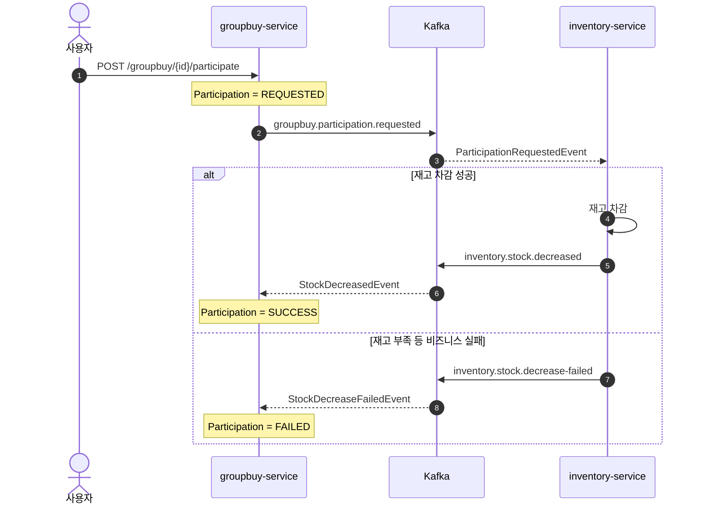

# 🛒 Event-Driven Group Purchase MSA

Apache Kafka와 Spring Boot 기반의 이벤트 주도 공동구매 시스템입니다.

공동구매 참여, 재고 차감, 주문 생성, 결제와 취소 보상을 비동기 이벤트로 연결합니다. 서비스별 데이터베이스를 분리하고 Choreography Saga 방식으로 서비스 간 결합도를 낮추면서 최종적 일관성을 관리하는 학습 프로젝트입니다.

## System Architecture

```text
                         HTTP API
                            |
                            v
                  +--------------------+
                  |  groupbuy-service  |
                  |  Java / Spring     |
                  +---------+----------+
                            |
                            | publish / consume
                            v
                  +--------------------+
                  |    Apache Kafka    |
                  |    KRaft mode      |
                  +---------+----------+
                            |
                            | publish / consume
                            v
                  +--------------------+
                  | inventory-service  |
                  | Kotlin / Spring    |
                  +--------------------+

          groupbuy-service             inventory-service
                  |                            |
                  v                            v
       PostgreSQL :5433             PostgreSQL :5434
```

### 공동구매 참여와 재고 차감



### 주문, 결제와 보상 흐름

1. 공동구매 목표 수량이 달성되면 `groupbuy.confirmed` 이벤트가 발행됩니다.
2. 참여 성공 건을 기준으로 주문을 생성하고 `order.created` 이벤트를 발행합니다.
3. 결제 결과는 `payment.completed` 이벤트로 주문 상태에 반영됩니다.
4. 주문 취소 시 `order.cancelled` 이벤트를 발행하고 inventory-service가 재고를 복구합니다.

## Reliability

### Non-blocking Retry와 DLT

Kafka 리스너는 `@RetryableTopic`을 사용합니다. 시스템 예외가 발생하면 소비자 스레드에서 대기하지 않고 Retry 토픽으로 메시지를 이동시킨 후, 재시도를 모두 소모한 메시지를 DLT로 보냅니다.

```text
original topic
  → retry-1000
  → retry-2000
  → dlt
```

groupbuy-service와 inventory-service는 최종 실패 이벤트를 각 서비스의 `tb_failed_event`에 저장합니다.

| 컬럼 | 내용 |
| --- | --- |
| `topic` | 최초 원본 Kafka 토픽 |
| `payload` | 재처리에 필요한 원본 이벤트 JSON |
| `error_message` | 마지막 처리 실패 메시지 |
| `created_at` | 실패 기록 시각 |

inventory-service는 원본 Kafka 레코드의 `partition`과 `offset`도 함께 저장합니다. `(topic, original_partition, original_offset)` 복합 유일성 제약과 원자적인 중복 무시 INSERT를 사용하여 동일한 DLT 레코드가 재전달되어도 한 번만 기록합니다.

> Non-blocking Retry는 처리량을 보호하지만 동일 키 이벤트의 처리 순서가 달라질 수 있습니다. 도메인 상태 전이와 멱등성 보강은 지속적인 개선 대상입니다.

### Schema Management

- groupbuy-service와 inventory-service는 Flyway 마이그레이션과 `ddl-auto=validate`를 사용합니다.
- 서비스별 PostgreSQL 데이터베이스를 독립적으로 사용하며 다른 서비스의 테이블이나 Repository를 직접 참조하지 않습니다.
- Kafka payload는 Jackson 3 기반 message converter를 통해 이벤트 DTO로 바인딩됩니다.

## Tech Stack

| 분류 | 기술 |
| --- | --- |
| Runtime | Java 21 |
| Framework | Spring Boot 4.0.6 |
| Languages | Java, Kotlin 2.1 |
| Data | Spring Data JPA, PostgreSQL 16, Flyway |
| Messaging | Apache Kafka (KRaft), Spring Kafka |
| Serialization | Jackson 3 (`tools.jackson.*`) |
| Infrastructure | Docker, Docker Compose, Kafka UI |

## Services

### [groupbuy-service](services/groupbuy-service)

Java 기반 핵심 서비스입니다.

- 상품 등록과 조회
- 공동구매 생성과 오픈
- 참여 요청과 상태 관리
- 주문 생성, 결제 결과 반영과 취소
- Kafka Retry/DLT 및 최종 실패 이벤트 대사

주요 HTTP API:

| Method | Path | 설명 |
| --- | --- | --- |
| `POST` | `/products` | 상품 등록 |
| `GET` | `/products` | 상품 목록 조회 |
| `GET` | `/products/{productId}` | 상품 단건 조회 |
| `POST` | `/groupbuy` | 공동구매 생성 |
| `POST` | `/groupbuy/{groupbuyId}/open` | 공동구매 오픈 |
| `POST` | `/groupbuy/{groupbuyId}/participate` | 공동구매 참여 요청 |

### [inventory-service](services/inventory-service)

Kotlin 기반 재고 서비스입니다.

- 상품 생성 이벤트를 통한 재고 등록
- 참여 요청 이벤트를 통한 재고 차감
- 재고 차감 성공·실패 이벤트 발행
- 주문 취소 이벤트를 통한 재고 복구
- Kafka Retry/DLT 및 원본 레코드 좌표 기반 실패 이벤트 중복 방지

### Skeleton Services

- [product-service](services/product-service)
- [user-service](services/user-service)

향후 상품과 사용자 도메인을 별도 서비스로 분리하기 위한 애플리케이션 스켈레톤입니다.

## Run Locally

### Prerequisites

- JDK 21
- Docker 및 Docker Compose

### 1. Infrastructure

```bash
docker compose up -d
```

| Component | Address |
| --- | --- |
| Kafka external listener | `localhost:9094` |
| Kafka UI | [http://localhost:8989](http://localhost:8989) |
| groupbuy PostgreSQL | `localhost:5433` |
| inventory PostgreSQL | `localhost:5434` |

### 2. Applications

macOS/Linux:

```bash
cd services/groupbuy-service
./gradlew bootRun

cd ../inventory-service
./gradlew bootRun
```

Windows PowerShell:

```powershell
cd services/groupbuy-service
.\gradlew.bat bootRun

cd ..\inventory-service
.\gradlew.bat bootRun
```

| Service | Port |
| --- | --- |
| groupbuy-service | `8081` |
| inventory-service | `8082` |

## Main Kafka Topics

| Topic | Producer | Consumer | 목적 |
| --- | --- | --- | --- |
| `product.created` | groupbuy-service | inventory-service | 재고 초기화 |
| `groupbuy.participation.requested` | groupbuy-service | inventory-service | 재고 차감 요청 |
| `inventory.stock.decreased` | inventory-service | groupbuy-service | 참여 확정 |
| `inventory.stock.decrease-failed` | inventory-service | groupbuy-service | 참여 실패 |
| `groupbuy.confirmed` | groupbuy-service | groupbuy-service | 주문 일괄 생성 |
| `order.created` | groupbuy-service | groupbuy-service | 결제 생성 |
| `payment.completed` | groupbuy-service | groupbuy-service | 주문 완료·취소 |
| `order.cancelled` | groupbuy-service | inventory-service, groupbuy-service | 재고 복구와 참여 실패 처리 |

## Roadmap

- Transactional Outbox를 통한 DB 트랜잭션과 Kafka 발행의 원자성 강화
- 이벤트 ID 기반 소비 멱등성 보장
- Retry/DLT lag 및 실패 이벤트 운영 모니터링
- 안전한 DLT Replay 절차와 복구 상태 관리
- malformed JSON처럼 DTO 변환 단계에서 실패한 메시지의 원문 보존
- API Gateway와 서비스 디스커버리 검토
