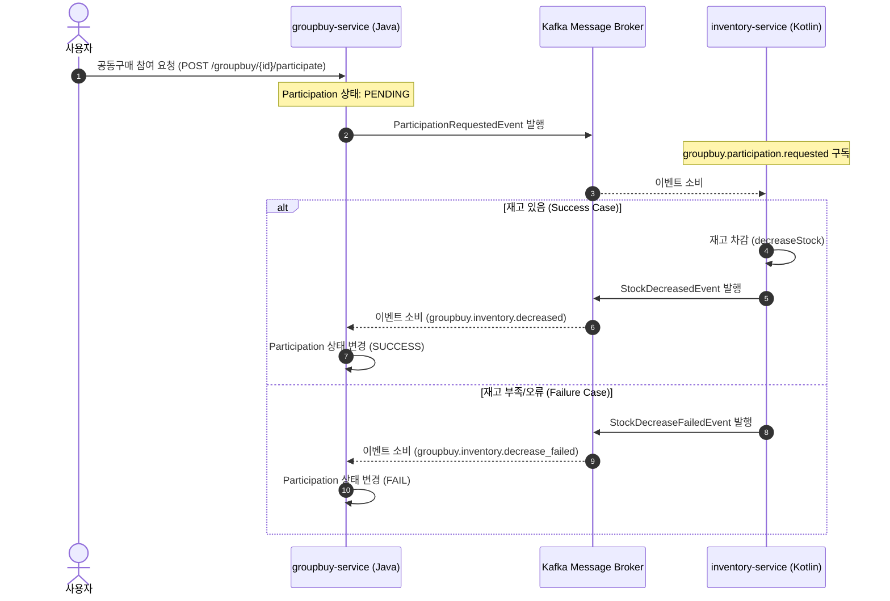

# 🛒 Event-Driven Group Purchase MSA (공동구매 마이크로서비스)

> **Apache Kafka와 Spring Boot 기반의 비동기 이벤트 주도 공동구매 시스템**
>
> 본 프로젝트는 동시성 제어 및 데이터 정합성 보장이 필요한 공동구매 시나리오를 가정하고, 비동기 데이터 일관성 보장과 서비스 간 결합도 완화를 위해 설계된 **이벤트 주도 아키텍처(EDA)** 마이크로서비스 프로젝트입니다. 코레오그래피 사가(Choreography Saga) 패턴을 적용하여 이종 서비스(주문-재고) 간의 비동기 트랜잭션 흐름을 관리합니다.


---

## 🏗️ 1. System Architecture & Flow

본 프로젝트는 서비스 간 강한 결합을 피하고 확장성을 확보하기 위해 **Apache Kafka**를 메시지 브로커로 사용하여 비동기 통신을 수행합니다.

### 🔄 참여 및 재고 차감 비동기 플로우 (Saga Pattern)



### 💳 주문 & 결제 파이프라인
공동구매 목표 수량이 달성되어 마감(Confirm)되면 다음 시나리오가 트리거됩니다:
1. `groupbuy-service` 내부에서 참여 성공한 인원들을 대상으로 **주문을 일괄 생성(Batch Create)**합니다.
2. 주문이 생성되면 `OrderCreatedEvent`가 발행되어 내부 `payment` 도메인으로 전송됩니다.
3. 결제 처리 결과(성공/실패)에 따라 주문의 최종 상태(`PAID` 또는 `CANCELLED`)가 결정되며, 주문 취소 시 **보상 트랜잭션**으로 `OrderCancelledEvent`가 돌며 재고 롤백이 진행됩니다.

---

## 🛠️ 2. Tech Stack

| 분류 | 기술 기술 (Tech Stack) | 상세 설명 |
| :--- | :--- | :--- |
| **Common** | Java 21, Gradle, PostgreSQL | 기본 백엔드 언어 및 관계형 데이터베이스 |
| **Message Broker** | Apache Kafka (KRaft mode) | 마이크로서비스 간 비동기 이벤트 발행 및 소비 |
| **Microservices** | **groupbuy-service** (Spring Boot 4.0.5, Groovy Gradle) <br> **inventory-service** (Spring Boot 4.0.5, Kotlin Gradle) | 핵심 비즈니스 로직(공동구매/주문) 및 재고 관리 마이크로서비스 |
| **DevOps** | Docker, Docker Compose | 로컬 카프카 및 데이터베이스 인프라 컨테이너화 |

---

## 🗂️ 3. Service Specification

### 1) [groupbuy-service](file:///D:/Dev/group-purchase/services/groupbuy-service) (Java 21)
* **책임**: 상품 등록, 공동구매 생성/오픈, 사용자 참여 등록, 주문 일괄 생성 및 결제 연동.
* **주요 엔드포인트**:
  * `POST /products`: 상품 등록
  * `POST /groupbuy`: 공동구매 등록
  * `POST /groupbuy/{groupbuyId}/open`: 공동구매 활성화
  * `POST /groupbuy/{groupbuyId}/participate`: 공동구매 참여 신청 (비동기 처리 시작)

### 2) [inventory-service](file:///D:/Dev/group-purchase/services/inventory-service) (Kotlin)
* **책임**: 상품별 재고 관리, 카프카 이벤트를 수신하여 원자적(Atomic) 재고 차감 및 결과 이벤트 발행.
* **이벤트 리스너**:
  * `groupbuy.participation.requested` 토픽을 구독하여 재고 차감 비즈니스 로직 수행.

### 3) [product-service](file:///D:/Dev/group-purchase/services/product-service) & [user-service](file:///D:/Dev/group-purchase/services/user-service) (Skeletons)
* **책임**: 향후 `groupbuy-service`에 뭉쳐 있는 상품 및 사용자 도메인을 완전 분리하기 위한 빈 서비스 스켈레톤 코드.

---

## 🚀 4. How to Run Locally

### 1) 인프라 컨테이너 실행 (Docker Compose)
로컬 환경에 Kafka 브로커와 PostgreSQL 인스턴스를 띄웁니다.
```bash
docker compose up -d
```
* **Kafka UI**: [http://localhost:8989](http://localhost:8989) (카프카 토픽 및 이벤트 모니터링 가능)
* **Database Ports**: 
  * `groupbuy-db`: 5433 (User: groupbuy, DB: groupbuy)
  * `inventory-db`: 5434 (User: inventory, DB: inventory)

### 2) 서비스 실행
각 서비스의 디렉토리로 이동하여 Gradle을 통해 부트 스트랩을 실행합니다.
* **groupbuy-service**:
  ```bash
  cd services/groupbuy-service
  ./gradlew bootRun
  ```
* **inventory-service**:
  ```bash
  cd services/inventory-service
  ./gradlew bootRun
  ```

---

## 📈 5. Future Roadmap (향후 개선 계획)

- [ ] **Transactional Outbox Pattern 적용**: 카프카 메시지 발행 실패 시에도 로컬 DB 트랜잭션과 일관성을 유지할 수 있도록 Outbox 테이블 도입.
- [ ] **Spring Cloud Gateway & Eureka**: 서비스 엔드포인트 단일화 및 서비스 디스커버리 적용.
- [ ] **Kotlin 코루틴 도입**: `inventory-service` 내 비동기 논블로킹 재고 차감 속도 극대화.
